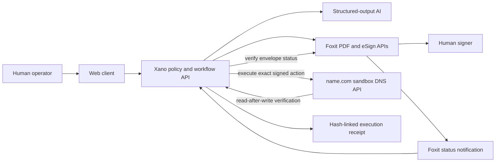

# Agent Warrant Protocol

> AI may propose the action. A human grants the authority. The system proves exactly what happened.

Agent Warrant Protocol is a human-authorization layer for high-risk AI agent actions. It turns an agent's proposed action into a narrow, expiring, single-use warrant, sends that warrant to a person for signature, and executes only the action that was explicitly approved.

The hackathon prototype applies the protocol to one concrete operation: changing a DNS record on a preconfigured name.com sandbox domain. The agent can prepare the change, explain its impact, and generate the authorization document. It cannot sign the document or touch DNS. A human must sign through Foxit eSign. The backend then verifies the completed envelope, checks every execution precondition, applies the exact DNS mutation, and emits a tamper-evident execution receipt.

This is not another confirmation dialog. It is a portable proof of delegated authority.

## Why this project exists

AI agents are moving from answering questions to changing real systems. They can update infrastructure, send contracts, approve refunds, move money, rotate credentials, and publish content. That creates a new authorization problem.

Traditional software permissions answer a broad question:

> Is this service account allowed to edit DNS?

Agent Warrant Protocol answers the narrower question that a human actually cares about:

> Did I authorize this specific agent to change this specific record from this exact value to that exact value, once, before this deadline?

Existing controls leave a dangerous gap:

- OAuth scopes and API keys are usually broad and long-lived.
- Chat prompts are ambiguous and easy to reinterpret.
- Approval buttons rarely preserve the exact payload that was approved.
- Audit logs prove that an API call happened, but not that a person authorized those exact parameters.
- An agent with credentials may be able to approve its own work.
- A delayed job can run after the world has changed, even if the original action was reasonable.

The result is a confused-deputy problem: a capable agent can act with a human's credentials without carrying a precise, verifiable statement of the human's intent.

## Why now

The DevNetwork API + Cloud + AI Hackathon asks whether a project solves a real problem, demonstrates meaningful progress, and could become a company. Its Foxit challenge makes the human boundary explicit: an agent should perform reversible document work, while a person remains responsible for signing. The name.com challenge rewards products where domain and DNS operations are central rather than decorative. Xano asks teams to rebuild frustrating business software with meaningful backend logic.

Agent Warrant Protocol joins those requirements into one coherent product:

1. AI converts a plain-language request into a structured action proposal.
2. Foxit produces and routes the warrant for human signature.
3. Xano enforces the warrant state machine and stores the audit chain.
4. name.com performs the approved DNS operation.
5. The system verifies the result and creates a receipt that binds intent, authorization, and execution.

Official references:

- [DevNetwork hackathon and sponsor challenges](https://api-cloud-ai-hackathon-2026.devpost.com/)
- [Foxit PDF Services API](https://developer-api.foxit.com/pdf-services/)
- [Foxit eSign API](https://developer-api.foxit.com/esign/)
- [name.com Core API](https://docs.name.com/api/v1/overview)
- [Xano documentation](https://docs.xano.com/)

## The problem

Consider a production incident. An operator tells an AI assistant:

> Point `status.example.com` at the emergency incident page for the next hour.

A normal agent might infer the record, call a DNS API with a standing token, and report success. That is fast, but it leaves important questions unanswered:

- Which domain and record did the operator mean?
- What value was present when the operator approved the change?
- What exact replacement value did the operator see?
- Could the agent change a different record with the same credentials?
- Was approval still valid when execution began?
- Did a stale request overwrite a newer emergency change?
- Can an auditor connect the prompt, signature, API request, and final DNS state?

Agent Warrant Protocol makes every one of those questions explicit.

## How it solves the problem

### 1. Convert intent into a proposed action

The AI receives a plain-language request and returns a typed proposal. For the MVP, the only permitted action type is `dns.record.update` against one preconfigured sandbox record.

The AI does not receive name.com credentials and cannot call the execution endpoint.

### 2. Freeze the action in a warrant

The backend reads the current DNS record and builds canonical warrant data containing:

- agent identity;
- action type;
- exact domain and record ID;
- current record value as a precondition;
- proposed new value;
- reason and human-readable impact;
- issue time and expiry time;
- single-use nonce;
- maximum execution count of one;
- SHA-256 digest of the canonical action payload;
- SHA-256 warrant digest binding the action to the signer, expiry, and nonce.

Both digests are printed inside the warrant PDF. If the action payload or authorization envelope changes, the signed document no longer authorizes it.

### 3. Require a human signature

Foxit creates an eSign envelope and presents an embedded signing session. The signer sees the before and after values, expiry, risk, and exact scope.

The agent cannot fill the signature. A redirect or webhook is treated only as a notification. Before authorization, the backend queries Foxit for the envelope's completed status and retrieves the signed artifact.

### 4. Execute with fail-closed checks

Execution first validates the signed warrant, then atomically reserves its one allowed use. The reserved execution proceeds only if all remaining checks pass:

- the warrant is in `AUTHORIZED` state;
- the signer completed the expected Foxit envelope;
- the warrant has not expired;
- the nonce has not been consumed;
- the requested action exactly matches the signed digest;
- the target is the preconfigured sandbox domain and record;
- no other execution won the warrant's compare-and-set transition;
- the live DNS value still equals the signed precondition immediately after reservation.

Any mismatch stops execution and consumes the failed warrant, forcing a fresh human review. The system creates an audit event but does not attempt a "close enough" change.

### 5. Verify and issue a receipt

After name.com accepts the update, the backend reads the record again. It records the observed value, timestamps, provider request identifiers, signed-document hash, action digest, and the previous audit-event hash.

The result is an execution receipt that can answer three questions:

1. What did the agent propose?
2. What did the person authorize?
3. What did the external system actually do?

## The 90-second demo

1. Enter: "Switch `status.sandbox-domain.example` to the emergency page now."
2. Watch the agent produce a structured proposal and risk explanation.
3. Compare the current and proposed DNS values.
4. Generate the warrant PDF.
5. Sign it inside the Foxit embedded signing view.
6. See the execution button unlock only after server-side verification.
7. Execute the change through the name.com sandbox API.
8. Re-read the DNS record and show the successful receipt.
9. Attempt to execute the same warrant again and show the one-time nonce rejection.

The final replay attempt is important. It proves the warrant is a real capability boundary, not decorative paperwork.

## Trust model

The protocol follows five rules:

1. **Agents propose; humans authorize.** The same actor cannot perform both roles.
2. **Authority is specific.** A warrant names one action, one resource, one before-state, and one after-state.
3. **Authority expires.** A signed warrant is invalid after its deadline.
4. **Authority is single-use.** Successful execution consumes the nonce atomically.
5. **Execution is observable.** Every state transition and external response enters a hash-linked audit chain.

The signed PDF is evidence of approval, not executable code. The backend remains the policy enforcement point.

## MVP scope

The hackathon build intentionally supports only:

- one preconfigured name.com sandbox domain;
- one preconfigured DNS record;
- one action type: update that record;
- one agent identity;
- one human signer per warrant;
- a ten-minute authorization window;
- one execution attempt after authorization;
- Foxit PDF generation and eSign;
- Xano persistence, workflow logic, and audit events;
- name.com sandbox read, update, and verification calls;
- a downloadable execution receipt.

The ten-minute window limits when the signed warrant may be executed. It does not schedule a DNS rollback or limit how long the new DNS value remains active.

The MVP does not support production DNS, arbitrary shell commands, payments, generic OAuth delegation, multiple signers, blockchain settlement, or legal non-repudiation claims.

## Architecture at a glance

The browser never receives Foxit, name.com, or model credentials. Xano owns the state machine and is the only component allowed to call the DNS mutation endpoint.

See [Technical Architecture](docs/ARCHITECTURE.md) for trust boundaries, the data model, APIs, state machines, failure handling, and threat analysis.

## Documentation

- [Product Requirements](docs/REQUIREMENTS.md): users, scope, functional requirements, acceptance criteria, and delivery plan.
- [Technical Architecture](docs/ARCHITECTURE.md): components, integrations, data model, API contracts, invariants, and security design.

Every document is reachable from this README and distinguishes planned behavior from implemented behavior.

## Current status

**Documentation-first workspace. No product implementation exists yet.**

The next build gate is an integration spike that must prove all three external operations before UI work begins:

1. Foxit can create a draft warrant, open an embedded signing session, and report completed status.
2. name.com sandbox can list, update, and re-read the selected DNS record.
3. Xano can receive the Foxit notification, verify status server-side, atomically consume a warrant, and store the resulting event chain.

If any core integration fails, the scope must shrink without faking the sponsor API path.

## Sponsor fit

### Foxit: Your Agent Shouldn't Sign That

Foxit is the boundary between reversible agent preparation and irreversible human authorization. The agent may create and populate the warrant, but only the human signer can move it toward execution.

### name.com: Domain API Challenge

DNS is the concrete action the product protects. The prototype uses multiple central operations: read the current record, update it after authorization, re-read it for verification, and optionally publish a receipt digest as a TXT record.

### Xano: Rebuild a SaaS Tool You Hate

Xano replaces the usual pile of approval tickets, chat screenshots, webhook glue, and audit spreadsheets. It stores the data model, exposes authenticated APIs, validates transitions, receives provider callbacks, and maintains the audit chain.

## Product direction after the hackathon

The long-term product is a vendor-neutral authorization gateway for agentic systems. The same warrant model could protect:

- infrastructure changes;
- production deployments;
- refunds and payouts;
- contract dispatch;
- user-data exports and deletions;
- credential rotation;
- public communications.

Those actions are deliberately out of scope for the prototype. The DNS demo exists to prove the protocol with one visible, consequential, reversible operation.

## License

License selection is pending. Do not assume production or commercial usage rights until a license file is added.
