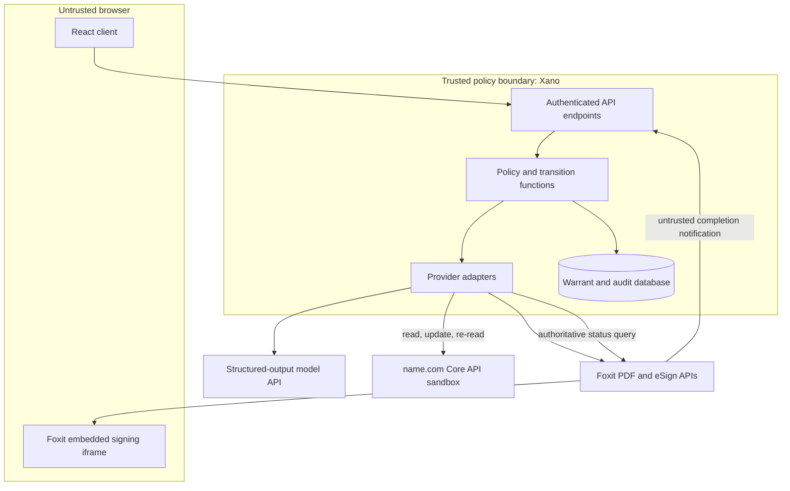
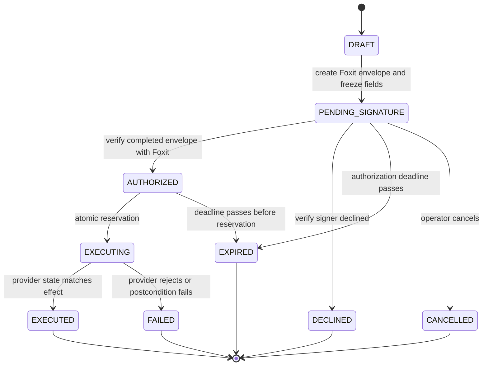
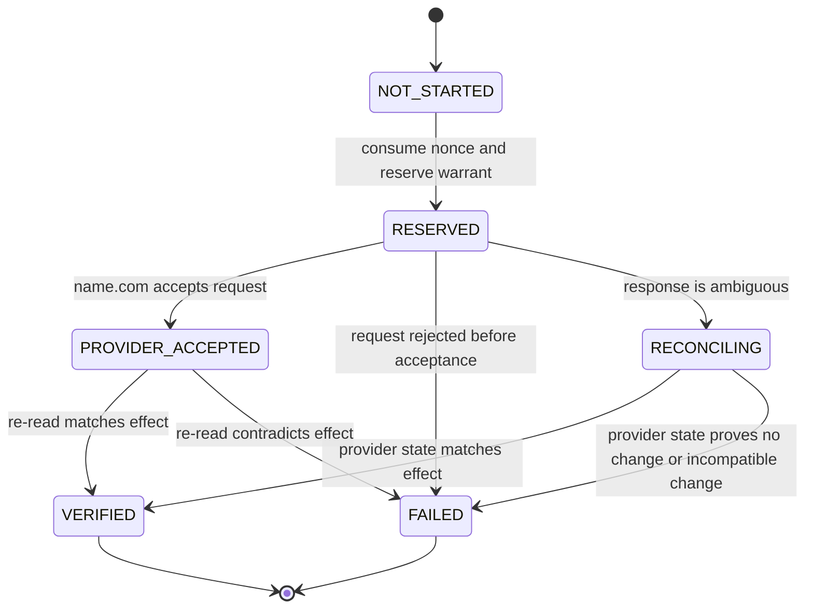
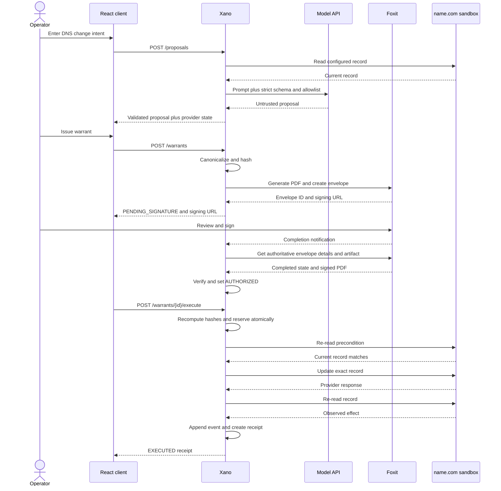

# Agent Warrant Protocol: Technical Architecture

Status: Proposed architecture

Version: 0.1

Date: 2026-09-03

This document defines the implementation contract for the hackathon MVP. It describes planned behavior. No product implementation exists at the time of writing.

## 1. Architecture goals

The system must prove a narrow chain of authority:

```text
human intent
  -> agent proposal
  -> frozen warrant
  -> human signature
  -> server verification
  -> exact external action
  -> observed result
  -> verifiable receipt
```

The architecture must prevent four failures:

1. The agent executes without human authorization.
2. The executed parameters differ from the signed parameters.
3. A stale warrant overwrites a newer external state.
4. A valid warrant executes more than once.

## 2. System boundary

### In scope

- React web client.
- Xano backend, database, workflow logic, and webhook endpoint.
- One structured-output model call for proposal drafting.
- Foxit document generation and eSign.
- name.com sandbox DNS reads and one authorized update.
- HTML and JSON execution receipts.

### Out of scope

- General-purpose agent runtime.
- Production DNS.
- Arbitrary credentials or user-supplied provider accounts.
- Distributed consensus or blockchain verification.
- Legal validation of signer identity beyond Foxit's completed-envelope result.
- Automated rollback.

## 3. Component model



### 3.1 React client

Responsibilities:

- collect the operator's plain-language request;
- display the structured proposal and live provider state;
- display exact before-and-after values;
- request warrant generation;
- open the Foxit-provided signing URL;
- poll persisted warrant state;
- request execution after authorization;
- render failures and the final receipt.

The client is not trusted to set target scope, authorization state, digests, timestamps, nonce, or execution parameters.

### 3.2 Xano backend

Xano is the policy enforcement point and the source of truth for workflow state. It must provide:

- authenticated and rate-limited API endpoints;
- tables for proposals, warrants, envelopes, executions, events, and receipts;
- reusable validation and canonicalization functions;
- external API requests to the model, Foxit, and name.com;
- a Foxit callback endpoint;
- atomic warrant reservation;
- immutable event append logic;
- receipt generation.

Xano is a meaningful sponsor integration, not storage behind another backend. The core authorization and execution state machine runs there.

### 3.3 Structured-output model

The model converts an operator's sentence into a candidate proposal and risk explanation. Its output is untrusted input.

The model cannot:

- read secrets;
- select an unconfigured resource;
- determine the live before-state;
- create nonce or expiry values;
- set a warrant state;
- call Foxit or name.com;
- approve or execute an action.

### 3.4 Foxit

Foxit performs two jobs:

1. Produce the human-readable warrant PDF.
2. Run the human signing flow and expose authoritative envelope status and completed artifacts.

Foxit eSign uses an envelope as the document package and signing workflow. The implementation may receive a redirect or webhook after signing, but must validate the final envelope status through a server-side Foxit API call before granting authority.

Relevant official surfaces:

- [Foxit PDF Services API](https://developer-api.foxit.com/pdf-services/)
- [Foxit eSign API](https://developer-api.foxit.com/esign/)
- [Foxit eSign integration guide](https://developer-api.foxit.com/developer-blogs/api-guides-tutorials/esignature-api-guide-add-signing-app/)

### 3.5 name.com

name.com is the protected action provider. The MVP uses Core API sandbox endpoints under `https://api.dev.name.com/core/v1`.

Required operations:

- list or fetch the configured DNS record;
- update the exact configured record;
- fetch it again for postcondition verification.

The API uses HTTP Basic authentication with the sandbox username and token. Credentials remain in Xano secrets. name.com documents a minimum DNS TTL of 300 seconds, so the demo verifies state through the provider API and does not wait for public recursive DNS propagation.

Relevant official surfaces:

- [Core API overview](https://docs.name.com/api/v1/overview)
- [List DNS records](https://docs.name.com/api/v1/reference/dns/list-records)
- [Create DNS record](https://docs.name.com/api/v1/reference/dns/create-record)

## 4. Trust boundaries

| Boundary | Trusted input | Untrusted input | Enforcement |
|---|---|---|---|
| Browser to Xano | Auth token issued by Xano | All body fields and UI state | Schema validation, allowlist, server-owned fields |
| Model to Xano | Nothing by default | Entire model response | Strict schema, extra-field rejection, server scope check |
| Foxit callback to Xano | Callback as a wake-up signal | Claimed event and status | Query Foxit directly before transition |
| Xano to name.com | Frozen executable payload | Provider response until validated | Exact request construction and re-read |
| Stored warrant to executor | Server-owned record in `AUTHORIZED` state | Any mutable or missing field | Recompute digests and atomic compare-and-set |
| Receipt to reader | Hashes and observed provider state | Human interpretation | Explicit labels and no compliance claims |

## 5. Core invariants

The implementation must enforce these invariants in backend logic and tests:

1. Only `AUTHORIZED` warrants may become `EXECUTING`.
2. Only one request may win the `AUTHORIZED -> EXECUTING` transition.
3. Executable fields cannot change after Foxit envelope creation.
4. An authorization expires at `expires_at`, regardless of signing-session state.
5. One warrant authorizes no more than one external mutation.
6. The execution request body cannot override signed action fields.
7. The live DNS precondition must equal the signed precondition immediately before mutation.
8. A Foxit callback alone never authorizes a warrant.
9. A name.com write response alone never proves success; read-after-write must match.
10. Every state transition appends one audit event.
11. Terminal warrants never return to an executable state.
12. An ambiguous provider timeout is never blindly retried.

## 6. Warrant representation

### 6.1 Canonical executable action

Canonicalization should use JSON Canonicalization Scheme, RFC 8785, or a byte-identical equivalent proven by fixtures. The executable payload for `action.v1` is:

```json
{
  "version": "action.v1",
  "action_type": "dns.record.update",
  "resource": {
    "provider": "name.com",
    "environment": "sandbox",
    "domain": "<sandbox-domain>",
    "record_id": 12345
  },
  "precondition": {
    "type": "CNAME",
    "host": "status",
    "answer": "normal-status-page.example.",
    "ttl": 300
  },
  "effect": {
    "type": "CNAME",
    "host": "status",
    "answer": "emergency-status-page.example.",
    "ttl": 300
  }
}
```

```text
action_digest = SHA256(JCS(executable_action))
```

The operator-facing rationale is not executable and is excluded from `action_digest`. Changing the rationale after issuance is still forbidden because it is part of the warrant envelope described next.

### 6.2 Authorization envelope

```json
{
  "version": "warrant.v1",
  "warrant_id": "<uuid>",
  "agent_id": "demo-dns-agent",
  "action_digest": "<sha256>",
  "signer_email_hash": "<sha256>",
  "reason": "Emergency status-page cutover",
  "issued_at": "2026-09-03T00:00:00Z",
  "not_before": "2026-09-03T00:00:00Z",
  "expires_at": "2026-09-03T00:10:00Z",
  "nonce": "<128-bit-or-greater-random-value>",
  "max_executions": 1
}
```

```text
warrant_digest = SHA256(JCS(authorization_envelope))
```

The PDF displays both digests. The backend stores the unsigned PDF hash, Foxit envelope ID, signed PDF hash, action digest, and warrant digest.

### 6.3 Why two digests

- `action_digest` proves the exact external mutation and precondition.
- `warrant_digest` binds that action to the agent, signer, reason, time window, nonce, and single-use limit.

The executor recomputes both from frozen records before reserving the warrant.

## 7. State machines

### 7.1 Warrant lifecycle



`EXECUTING` may require reconciliation after an ambiguous network timeout. It must not transition back to `AUTHORIZED`.

### 7.2 Execution lifecycle



## 8. Primary sequence



## 9. Data model

Xano table names are proposed contracts. Field types should map to native Xano types where available.

### 9.1 `actors`

| Field | Type | Notes |
|---|---|---|
| `id` | uuid | Primary key |
| `kind` | enum | `human` or `agent` |
| `display_name` | text | Demo-safe name |
| `email_encrypted` | text nullable | Human signer only, restricted access |
| `email_sha256` | text nullable | Used in warrant and receipt |
| `status` | enum | `active` or `disabled` |
| `created_at` | timestamp | UTC |

### 9.2 `action_proposals`

| Field | Type | Notes |
|---|---|---|
| `id` | uuid | Primary key |
| `operator_id` | uuid | References human actor |
| `agent_id` | uuid | References agent actor |
| `prompt_ciphertext` | text | Optional encrypted prompt storage |
| `prompt_sha256` | text | Receipt-safe reference |
| `model_provider` | text | Provider metadata |
| `model_name` | text | Exact model identifier |
| `prompt_version` | text | Fixed template version |
| `raw_output_path` | text | Restricted storage reference |
| `raw_output_sha256` | text | Audit metadata |
| `validated_action_json` | json | Candidate after schema validation |
| `validation_status` | enum | `valid` or `rejected` |
| `validation_errors_json` | json | Structured reasons |
| `created_at` | timestamp | UTC |

### 9.3 `warrants`

| Field | Type | Notes |
|---|---|---|
| `id` | uuid | Warrant ID |
| `proposal_id` | uuid | Source proposal |
| `version` | text | `warrant.v1` |
| `agent_id` | uuid | Authorized agent |
| `signer_id` | uuid | Expected human |
| `action_json` | json | Frozen executable payload |
| `action_digest` | text | SHA-256 hex |
| `authorization_json` | json | Frozen authorization envelope |
| `warrant_digest` | text | SHA-256 hex |
| `nonce_sha256` | text | Do not expose raw nonce after use |
| `max_executions` | integer | Fixed to 1 |
| `execution_count` | integer | Starts at 0 |
| `state` | enum | Warrant lifecycle state |
| `issued_at` | timestamp | UTC |
| `not_before` | timestamp | UTC |
| `expires_at` | timestamp | UTC |
| `state_version` | integer | Compare-and-set version |
| `created_at` | timestamp | UTC |
| `updated_at` | timestamp | UTC |

Executable and authorization fields become immutable when state leaves `DRAFT`.

### 9.4 `signing_envelopes`

| Field | Type | Notes |
|---|---|---|
| `id` | uuid | Internal ID |
| `warrant_id` | uuid | Unique reference |
| `provider` | text | `foxit` |
| `provider_envelope_id` | text | Unique |
| `provider_status` | text | Last verified status |
| `unsigned_pdf_path` | text | Private storage reference |
| `unsigned_pdf_sha256` | text | Hash before send |
| `signed_pdf_path` | text nullable | Private completed artifact |
| `signed_pdf_sha256` | text nullable | Hash after completion |
| `signing_url_ciphertext` | text nullable | Short-lived, never logged |
| `last_verified_at` | timestamp nullable | UTC |
| `created_at` | timestamp | UTC |

### 9.5 `executions`

| Field | Type | Notes |
|---|---|---|
| `id` | uuid | Primary key |
| `warrant_id` | uuid | Unique for MVP |
| `idempotency_key` | text | Unique digest of warrant and attempt |
| `state` | enum | Execution lifecycle |
| `requested_action_json` | json | Byte-equivalent to frozen action |
| `preflight_record_json` | json | Live state before mutation |
| `provider_request_sha256` | text | Hash of outbound request |
| `provider_request_id` | text nullable | If returned by name.com |
| `provider_response_path` | text nullable | Restricted raw response |
| `provider_response_sha256` | text nullable | Audit metadata |
| `observed_record_json` | json nullable | Read-after-write result |
| `error_code` | text nullable | Stable internal code |
| `started_at` | timestamp | UTC |
| `completed_at` | timestamp nullable | UTC |

### 9.6 `audit_events`

| Field | Type | Notes |
|---|---|---|
| `id` | uuid | Primary key |
| `warrant_id` | uuid | Event stream key |
| `sequence` | integer | Unique within warrant |
| `event_type` | text | Stable event name |
| `actor_kind` | enum | `human`, `agent`, `system`, or `provider` |
| `actor_id` | text | Internal or provider ID |
| `before_state` | text nullable | Previous state |
| `after_state` | text nullable | New state |
| `metadata_json` | json | Redacted event details |
| `previous_event_hash` | text nullable | Null for first event |
| `event_hash` | text | SHA-256 over canonical event record |
| `created_at` | timestamp | UTC |

The application exposes no update or delete endpoint for audit events.

### 9.7 `receipts`

| Field | Type | Notes |
|---|---|---|
| `id` | uuid | Primary key |
| `warrant_id` | uuid | Unique |
| `execution_id` | uuid | Unique |
| `receipt_version` | text | `receipt.v1` |
| `receipt_json` | json | Public-safe receipt |
| `receipt_sha256` | text | Canonical JSON digest |
| `event_chain_head` | text | Final audit-event hash |
| `created_at` | timestamp | UTC |

## 10. API surface

These are planned product endpoints, not Foxit or name.com paths.

### `POST /proposals`

Creates and validates an AI proposal.

Request:

```json
{
  "intent": "Switch the status subdomain to the emergency page now"
}
```

Response:

```json
{
  "proposal_id": "<uuid>",
  "status": "valid",
  "action": {},
  "provider_observed_current_state": {},
  "risk_summary": "This changes where the public status subdomain resolves."
}
```

### `POST /warrants`

Freezes a valid proposal, computes digests, generates the Foxit document, and creates the eSign envelope.

Request:

```json
{
  "proposal_id": "<uuid>"
}
```

Response includes `warrant_id`, `state=PENDING_SIGNATURE`, `expires_at`, both digests, and the provider-issued signing URL or a backend route that redirects to it.

### `GET /warrants/{warrant_id}`

Returns public-safe state, proposal summary, timestamps, digest values, execution eligibility, and blocking reason. It never returns provider credentials, raw nonce, or unrestricted signing URL data.

### `POST /warrants/{warrant_id}/verify-signature`

Queries Foxit directly and applies an idempotent transition. It may be called after a webhook, browser redirect, or user refresh.

### `POST /webhooks/foxit`

Stores a redacted callback event and schedules or invokes signature verification. It returns quickly. It does not authorize the warrant from callback fields alone.

### `POST /warrants/{warrant_id}/execute`

Accepts no action override. The warrant ID identifies the frozen action. The endpoint performs all execution gates, atomically reserves the warrant, calls name.com, re-reads state, and returns a receipt or stable error.

Optional request:

```json
{
  "idempotency_key": "<client-generated-uuid>"
}
```

### `GET /receipts/{receipt_id}`

Returns the public-safe `receipt.v1` representation and hash-chain head.

### `GET /health`

Reports application health without exposing credential state. External dependency checks should be opt-in and redacted.

## 11. Receipt schema

The public receipt separates claims by source:

```json
{
  "version": "receipt.v1",
  "receipt_id": "<uuid>",
  "warrant_id": "<uuid>",
  "agent_id": "demo-dns-agent",
  "signer_email_hash": "<sha256>",
  "prompt_sha256": "<sha256>",
  "action_digest": "<sha256>",
  "warrant_digest": "<sha256>",
  "signed_pdf_sha256": "<sha256>",
  "authorized_at": "<utc-timestamp>",
  "execution": {
    "requested": {},
    "provider_accepted_at": "<utc-timestamp>",
    "observed": {},
    "verified_at": "<utc-timestamp>"
  },
  "event_chain_head": "<sha256>",
  "created_at": "<utc-timestamp>"
}
```

The receipt must not include the raw nonce, provider token, full signer email, signing-session token, or unrestricted private artifact URL.

## 12. Audit-chain construction

For event `n`:

```text
event_body = JCS({
  warrant_id,
  sequence,
  event_type,
  actor_kind,
  actor_id,
  before_state,
  after_state,
  metadata_json,
  previous_event_hash,
  created_at
})

event_hash = SHA256(event_body)
```

The chain is tamper-evident, not externally immutable. A database administrator could replace the entire chain. The MVP must describe it accurately and must not call it a blockchain or independent timestamp authority.

## 13. Idempotency and concurrency

### Proposal

Proposal creation may produce multiple independent proposals. It does not mutate DNS.

### Warrant issuance

Use `proposal_id` plus a server-generated issuance key. A valid proposal may have only one active non-terminal warrant. Reissuing after expiry creates a new warrant and nonce.

### Foxit callbacks

Deduplicate on provider envelope ID, event name, and provider event timestamp or payload hash. Duplicate delivery triggers the same direct verification and no duplicate transition.

### Execution

The critical operation is an atomic compare-and-set:

```text
UPDATE warrants
SET state = EXECUTING,
    execution_count = execution_count + 1,
    state_version = state_version + 1
WHERE id = :warrant_id
  AND state = AUTHORIZED
  AND execution_count = 0
  AND expires_at > :now
  AND state_version = :expected_version
```

The exact Xano implementation may use a transaction, conditional edit, or protected custom function. The API spike must prove equivalent behavior with two concurrent requests.

If the provider request times out after dispatch, keep the execution reserved and enter `RECONCILING`. Re-read the provider before deciding whether the effect occurred. Never return the warrant to `AUTHORIZED`.

## 14. Provider adapter behavior

### 14.1 Model adapter

- Send only the fixed action schema and allowlisted resource context.
- Use low randomness.
- Reject markdown-wrapped or schema-invalid output.
- Record hashes and model metadata.
- Do not continue on partial JSON.

### 14.2 Foxit adapter

- Generate the PDF with visible executable fields and both digests.
- Use a deterministic template version.
- Create one envelope for the configured signer.
- Store the complete Foxit signing URL encrypted or transiently.
- Treat redirect and webhook payloads as notifications.
- Query envelope details before authorization.
- Download the completed document and compute its hash.
- Redact tokens and signer details from logs.

### 14.3 name.com adapter

- Use `https://api.dev.name.com` for the MVP.
- Authenticate only from the trusted backend.
- Read the record by configured domain and ID.
- Normalize trailing dot behavior before equality checks.
- Reject record types outside the fixed allowlist.
- Send the update using fields from frozen `action_json`, not the browser request.
- Re-read the same record ID after the write.
- Preserve redacted raw responses for the demo audit trail.
- Respect `429` and provider errors, but do not auto-retry an ambiguous mutation.

## 15. Threat model

| Threat | Attack | Control | Residual risk |
|---|---|---|---|
| Prompt injection | Intent asks the model to ignore scope | Strict schema and server allowlist | Model may create noisy proposals, but cannot execute |
| Target substitution | Browser changes domain or record after preview | Executor ignores client action fields | Compromised backend remains trusted |
| Signature spoofing | Attacker calls callback endpoint with `completed` | Direct Foxit status query and envelope binding | Foxit account compromise is outside MVP |
| TOCTOU race | DNS changes after signing but before execution | Immediate provider re-read and exact precondition | Change could race between read and write if provider lacks conditional update |
| Replay | Same warrant executed twice | Atomic reservation, nonce, unique execution row | Requires proven Xano compare-and-set behavior |
| Stale response | Old provider response arrives late | State version and immutable attempt record | Provider inconsistency may require reconciliation |
| Credential exposure | Browser or logs reveal API token | Server secrets and redacted logging | Xano admin access remains sensitive |
| Receipt tampering | Receipt JSON edited after download | Receipt hash and audit-chain head | No independent public anchor in P0 |
| PDF/action mismatch | Rendered PDF differs from stored JSON | Deterministic template, visible digests, stored hashes | Full semantic PDF re-parsing is deferred |
| SSRF or arbitrary API call | Proposal injects URL or provider | Fixed adapter and target allowlist | New action types require separate review |
| XSS | Prompt or reason renders script content | Contextual output escaping | PDF/template engine behavior must be tested |

### TOCTOU limitation

Time-of-check-to-time-of-use risk cannot be fully eliminated if name.com does not expose a conditional DNS update. The MVP minimizes the window by re-reading immediately before update and restricting the target to a sandbox record. Production support would require provider-native versioning, an external lock, or a compensating reconciliation policy.

## 16. Failure handling

| Failure | State | User-visible result | Mutation policy |
|---|---|---|---|
| Model timeout | Proposal rejected | Retry proposal or use disclosed prepared response | No external mutation |
| Foxit PDF failure | Warrant remains `DRAFT` | Show provider error and retry generation | No envelope or DNS mutation |
| Foxit signing URL expires | `PENDING_SIGNATURE` | Regenerate session if envelope remains valid | No DNS mutation |
| False or duplicate callback | No unsafe transition | Verification remains pending or idempotently complete | No DNS mutation |
| Warrant expires | `EXPIRED` | Issue a new warrant | No DNS mutation |
| DNS precondition differs | `FAILED`; reserved warrant remains consumed | Show signed and current values | No DNS mutation |
| name.com rejects request | `FAILED` | Show redacted provider error | Mutation attempted once |
| name.com times out | `RECONCILING` | Show unknown state, then re-read | No blind retry |
| Postcondition differs | `FAILED` | Show requested and observed values | Manual investigation |
| Receipt generation fails | `EXECUTED` with receipt repair task | Do not claim action failed; rebuild receipt from events | No second DNS mutation |

## 17. Deployment model

### Hackathon deployment

- React/Vite frontend hosted through Xano static hosting if the API spike proves the workflow; otherwise deploy the static client separately.
- Xano workspace provides database, APIs, reusable functions, webhook endpoint, and provider calls.
- Xano secrets store Foxit, name.com, and model credentials.
- All name.com calls use the sandbox environment.
- The demo domain and record ID are server configuration, not user input.

### Environment variables or secrets

Names only, never values:

```text
FOXIT_CLIENT_ID
FOXIT_CLIENT_SECRET
FOXIT_ESIGN_HOST
NAMECOM_USERNAME
NAMECOM_API_TOKEN
NAMECOM_BASE_URL
DEMO_DOMAIN
DEMO_RECORD_ID
MODEL_API_KEY
MODEL_NAME
PUBLIC_APP_URL
```

`NAMECOM_BASE_URL` must default to `https://api.dev.name.com` and require an explicit production build change before any production endpoint can be used.

## 18. Observability

Structured logs should include:

- correlation ID;
- proposal ID;
- warrant ID;
- execution ID;
- provider name;
- provider request ID when available;
- state before and after;
- stable error code;
- duration;
- redaction status.

Logs must not include:

- API credentials;
- signing-session URLs or tokens;
- raw nonce;
- full signer email;
- full prompt when prompt storage is disabled;
- unrestricted signed-document URL.

Metrics:

- proposal validation success rate;
- warrant generation latency;
- time waiting for human signature;
- envelope verification latency;
- execution gate rejection count by reason;
- provider call latency and error count;
- replay rejection count;
- receipt creation success rate.

## 19. Test architecture

### Unit tests

- strict proposal-schema validation;
- target allowlist;
- canonicalization fixtures;
- action and warrant digest fixtures;
- expiry boundaries;
- state-transition table;
- receipt canonicalization;
- audit-chain calculation;
- provider-response normalization.

### Contract tests

- Foxit envelope creation and completed-status fixture;
- Foxit completed-artifact retrieval;
- name.com list, update, and read response fixtures;
- model schema-valid and schema-invalid responses;
- Xano webhook input validation.

### Integration tests

- complete sandbox path;
- forged Foxit callback;
- concurrent execution requests;
- precondition change after signing;
- provider timeout and reconciliation;
- duplicate callback delivery;
- browser refresh at every state;
- replay after successful execution.

### Demo smoke test

Before recording or presenting:

1. Reset the sandbox record to the documented normal value.
2. Confirm the Foxit signer can access the configured address.
3. Run one complete warrant without recording.
4. Reset through a separately authorized maintenance process.
5. Run the recorded path.
6. Execute the replay rejection immediately after success.

## 20. Architecture decision record

### ADR-001: Use DNS as the protected action

Chosen because it is visible, consequential, reversible, and directly supported by a sponsor API. It is safer than payments or production deployment when limited to a sandbox.

### ADR-002: Use Xano as the policy enforcement point

Chosen to make Xano responsible for meaningful business logic, persistence, provider orchestration, and transition enforcement. A separate custom backend would weaken the sponsor fit and add deployment time.

### ADR-003: Treat Foxit callbacks as notifications

Chosen because browser redirects and inbound callback fields should not independently grant authority. A direct server-side status query provides a simpler trust rule.

### ADR-004: Use a signed PDF plus canonical JSON

The PDF gives humans an inspectable authorization artifact. Canonical JSON gives machines exact execution fields. Digests bind the two representations without asking an LLM to interpret the signed document during execution.

### ADR-005: Use hash-linked events, not blockchain

Hash-linked events are enough to demonstrate tamper evidence and replayable history in 48 hours. Blockchain would add key, network, latency, and product-story complexity without strengthening the central human-authorization demo.

### ADR-006: No automatic mutation retry

An ambiguous retry can duplicate or overwrite state. The system enters reconciliation and reads the provider before any human decides what to do next.

## 21. Implementation gates

Do not begin broad UI work until a vertical integration spike proves:

1. Foxit generates the warrant and completes one test signature.
2. The backend can verify the completed envelope and retrieve its artifact.
3. name.com sandbox lists, updates, and immediately re-reads the chosen record.
4. Xano prevents two simultaneous requests from reserving one warrant.
5. External credentials remain server-side in browser network inspection.

If the spike misses the time gate, cut P1 and P2 items first. Do not replace live Foxit signing, server-side verification, name.com execution, or replay rejection with mocks.

## 22. Related documentation

- [Project README](../README.md)
- [Product Requirements](REQUIREMENTS.md)
